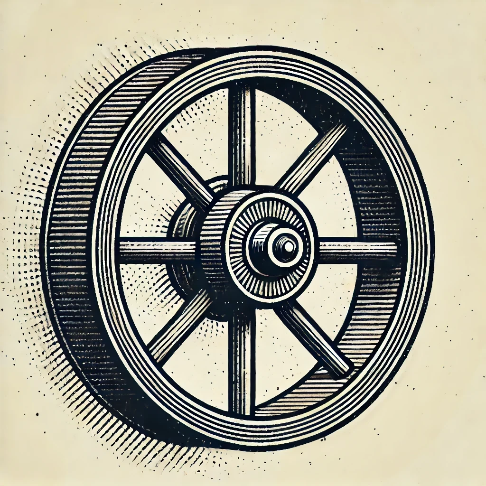

    <h1> AXLE </h1>
    

  <h3 align="center">What is it?</h3>

  

    A small and simple collection of cpp libraries.
  

    <h3 align="center">Getting Started.</h3>
      

    Not ready for any of that. It builds into an executable thats it.
  

